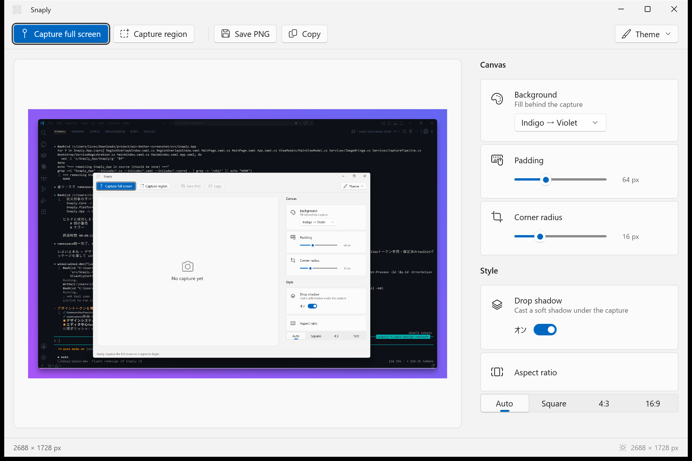
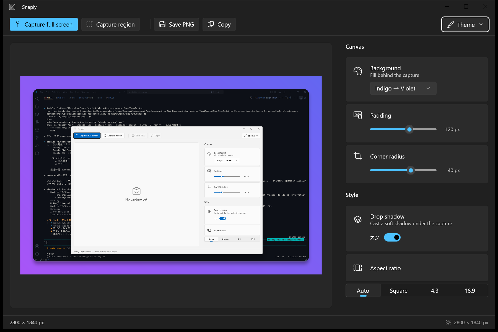
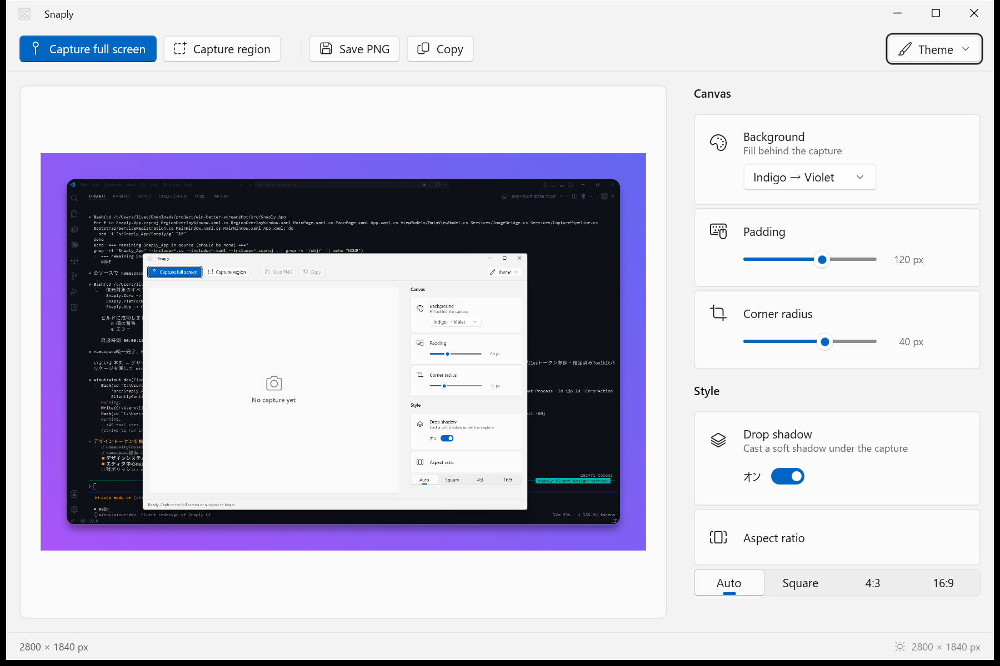

<h1 align="center">Snaply</h1>

<p align="center">
  A modern, clean-architecture screenshot tool for Windows 11 —
  capture, auto-beautify, and share in one keystroke.
</p>

<p align="center">
  <a href="https://github.com/P4suta/Snaply/actions/workflows/ci.yml"></a>
  <a href="https://github.com/P4suta/Snaply/actions/workflows/codeql.yml"></a>
  <a href="https://securityscorecards.dev/viewer/?uri=github.com/P4suta/Snaply"></a>
  <a href="LICENSE"></a>
</p>

<p align="center">
  
</p>

---

Snaply is a screenshot utility built the way a modern Windows app should be:
a **platform-independent, dependency-free core** wrapped by thin platform
adapters and a WinUI 3 shell. Existing tools (Greenshot, ShareX) carry a
decade of WinForms baggage; Snaply is a clean-room take on the same job.

## Features

- **Three capture modes** — full screen, region select, and window picker
  (hover-to-highlight), all reachable from a global hotkey or the tray.
- **Automatic beautification** — every capture is composited onto a harmonised
  gradient background (average colour → OKLCH hue-travel), with proportional
  padding, corner radius, and a drop shadow. No sliders to fiddle with.
- **Fluid preview** — cursor-anchored zoom and 1:1 pan, powered by Windows
  Composition spring animations on the compositor thread.
- **Capture-time self-hiding** — the app excludes itself from the capture
  deterministically (`SetWindowDisplayAffinity`), no hide-and-wait races.
- **Global hotkeys + system tray** — `PrintScreen` for region, `Ctrl+Shift+2`
  for full screen; runs quietly in the tray.
- **Save or copy** — PNG to disk or straight to the clipboard.
- **Fully localised** — English, 日本語, and 简体中文 (WinUI resources + MRT).
- **Fluent theming** — System / Light / Dark, with automatic High Contrast.

<p align="center">
  
  
</p>

## Architecture

Snaply follows **ports & adapters (hexagonal) clean architecture**. The
dependency arrow always points inward; the core never references a platform.

```
┌─────────────────────────────────────────────────────────────┐
│  Snaply.App        WinUI 3 shell · DI composition root ·      │
│                    ViewModels · XAML views                    │
│      │  depends on                                            │
│      ▼                                                         │
│  Snaply.Platform   Adapters: WGC capture · Win2D compositing ·│
│                    PNG/clipboard · Win32 hotkeys · tray       │
│      │  depends on                                            │
│      ▼                                                         │
│  Snaply.Core       Zero dependencies · immutable records ·    │
│                    pure logic · Result-typed failures         │
└─────────────────────────────────────────────────────────────┘
```

`Snaply.Core` targets plain `net10.0` and has **no Windows dependency at all** —
its unit tests run on Linux in CI, which is the architecture fitness test made
executable. Pure functions live in the core; every side effect is isolated at
the outermost edge.

## Tech stack

WinUI 3 · Windows App SDK 2.2.0 · .NET 10 · Win2D · CommunityToolkit
(MVVM + WinUI controls) · Serilog · xUnit.

## Build & Run

The toolchain is provisioned with [mise](https://mise.jdx.dev/); recipes run
through [just](https://github.com/casey/just). No global SDK install needed.

```sh
mise install            # provision the pinned .NET 10 SDK + just
just build              # build the whole solution
just test               # run the headless Core unit tests
just run                # build the app (x64) and launch it
just publish            # assemble the self-contained bundle → build/dist/Snaply
```

**Prerequisites:** Windows 11, the Windows App SDK runtime (bundled in the
published build — the app ships self-contained and unpackaged).

## Download

Grab the latest self-contained build from the
[Releases](https://github.com/P4suta/Snaply/releases) page, unzip, and
double-click `Snaply.exe`. Nothing to install.

Release artifacts carry keyless [Sigstore](https://www.sigstore.dev/) build
provenance — verify a download with:

```sh
gh attestation verify snaply-*-win-x64.zip --repo P4suta/Snaply
```

## Contributing

Contributions are welcome — see [CONTRIBUTING.md](CONTRIBUTING.md). In short:
the toolchain is mise + just, commits follow
[Conventional Commits](https://www.conventionalcommits.org/), and the analyzer
gate (`TreatWarningsAsErrors`) must stay green.

## License

Licensed under the [Apache License 2.0](LICENSE). See [NOTICE](NOTICE) for
attribution.
